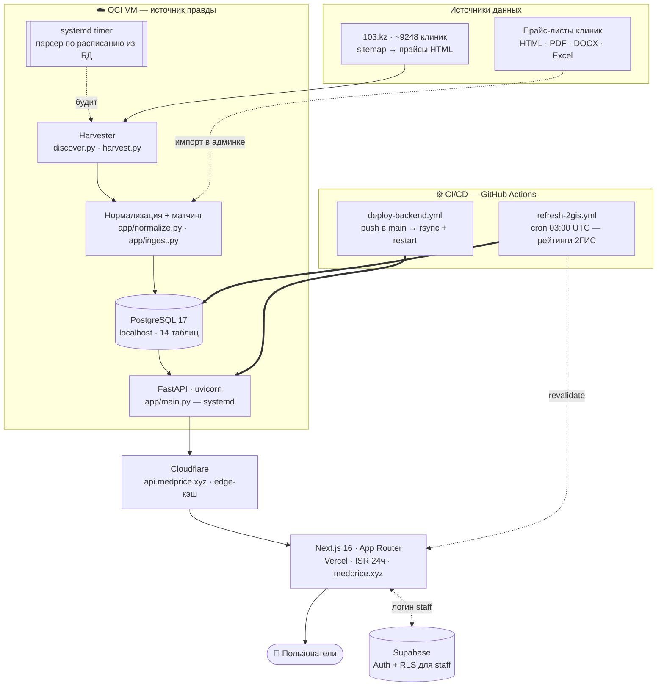
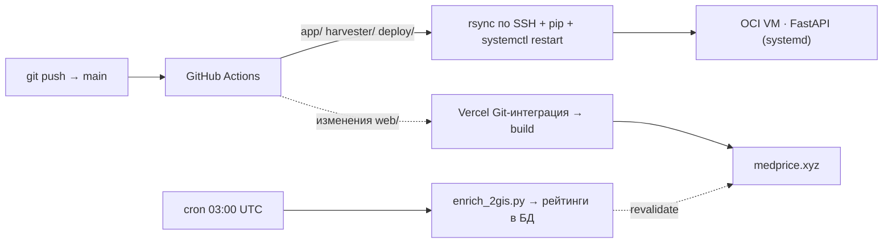

<div align="center">

# 🏥 medprice.xyz

**Агрегатор и сравнение цен на медицинские услуги в Казахстане**

Собирает прайс-листы клиник, сводит разнородные названия услуг к единому справочнику
и сравнивает цену одной услуги между клиниками — с фильтром по городу, рейтингами 2ГИС,
картой, историей цен и расчётом экономии.

🌐 **[medprice.xyz](https://medprice.xyz)** · 🔌 **[api.medprice.xyz](https://api.medprice.xyz)**

<br/>

**Frontend**


**Backend**


**Infra & Ops**


</div>

---

## Содержание

- [Что это и почему нетривиально](#что-это-и-почему-нетривиально)
- [Возможности](#возможности)
- [Архитектура](#архитектура)
- [Технологии](#технологии)
- [Движок матчинга — ядро](#движок-матчинга--ядро)
- [API](#api)
- [Локальный запуск](#локальный-запуск)
- [Деплой и эксплуатация](#деплой-и-эксплуатация)
- [Данные и оговорки](#данные-и-оговорки)

---

## Что это и почему нетривиально

Данных «из коробки» нет — их пришлось **добыть** парсером. И главная сложность не в
парсинге, а в том, что одна и та же услуга у разных клиник называется по-разному:

| Клиника | Как называется в прайсе | Цена |
|---|---|---|
| KDL Олимп | «Клинический анализ крови (с лейкоцитарной формулой)» | 800 ₸ |
| INVITRO | «Общий анализ крови с лейкоформулой и СОЭ» | 1 790 ₸ |
| Олимп | «Общий анализ крови без СОЭ» | 1 780 ₸ |

Чтобы цены можно было сравнивать, всё это нужно свести к одной канонической услуге
**«Общий анализ крови (ОАК)»**. Этим занимается [движок матчинга](#движок-матчинга--ядро).

---

## Возможности

- 🔎 **Поиск и сравнение** — цена одной услуги по всем клиникам: минимум, медиана, максимум, % экономии.
- 🏙️ **Фильтры** — город, цена, рейтинг 2ГИС, сортировка «дешевле / релевантнее / ближе» (геолокация).
- ⭐ **Избранное** — сохранение услуг конкретных клиник и сравнение их между собой (drag-and-drop).
- 🗺️ **Карта клиник** на Leaflet + диплинки маршрутов в 2ГИС.
- 📈 **История цен** — динамика стоимости услуги по клиникам во времени.
- 🧾 **Анализ прайса** — вставить свой прайс/счёт → распознавание услуг + вердикт «дороже/дешевле рынка».
- 🔔 **Подписки** на изменение цены услуги в клинике (e-mail-уведомления).
- 🛠️ **Панель модерации** (staff) — CRUD клиник/услуг, импорт прайс-листов (HTML / PDF / DOCX / Excel),
  очередь ручной разметки, управление парсером и расписанием.

---

## Архитектура

VM на Oracle Cloud — **источник правды**: на ней живут парсер, БД (локальный PostgreSQL) и API.
Фронт вынесен на Vercel, перед API стоит Cloudflare (edge-кэш). Supabase отвечает только за авторизацию.



### Слои

| # | Слой | Где живёт | Код |
|---|---|---|---|
| 1 | **Харвест** — обход 103.kz, многопоточная докачиваемая выкачка прайсов | OCI VM | `harvester/discover.py`, `harvester/harvest.py` |
| 2 | **Нормализация + ингест** — raw-название → каноническая услуга, дедуп | OCI VM | `app/normalize.py`, `app/ingest.py` |
| 3 | **Хранилище** — PostgreSQL 17 (локальный, 14 таблиц) | OCI VM | `app/database.py`, `migrations/` |
| 4 | **API** — поиск / сравнение / статистика / подписки / админка | OCI VM (systemd) | `app/main.py` |
| 5 | **Edge** — Cloudflare перед API (кэш, TLS, домен) | Cloudflare | — |
| 6 | **Фронт** — Next.js App Router, ISR-кэш каталога на 24ч | Vercel | `web/` |
| 7 | **Авторизация** — вход staff, двухуровневый доступ + RLS | Supabase | `app/auth.py`, `web/lib/auth.ts` |

---

## Технологии

| Слой | Стек |
|---|---|
| **Frontend** | Next.js 16 (App Router), React 19, TypeScript, Tailwind CSS 4, Leaflet (карта), `@supabase/supabase-js` (авторизация) |
| **Backend** | Python 3.12, FastAPI, SQLAlchemy 2 (Core), Pydantic 2, psycopg 3 |
| **База данных** | PostgreSQL 17 (self-hosted на VM; источник правды) |
| **Сбор данных** | собственный харвестер (requests + многопоточность), парсеры HTML / PDF / DOCX / Excel |
| **Обогащение** | 2ГИС Places API — рейтинги, отзывы, координаты, часы работы |
| **Инфраструктура** | Oracle Cloud (VM), Cloudflare (edge), Vercel (фронт), systemd (сервис + таймер) |
| **CI/CD** | GitHub Actions — деплой бэкенда по push, ежедневный refresh рейтингов |
| **Авторизация** | Supabase Auth + Row Level Security |

---

## Движок матчинга — ядро

`app/normalize.py` сводит разнородные прайсы к единому каталогу:

- **Нормализация** — регистр, `ё→е`, пунктуация, пробелы → канонический ключ.
- **Кураторский справочник** (`app/data/canonical.json`) — «якорные» услуги
  (анализы, гормоны, онкомаркеры, МРТ/КТ/УЗИ) и их синонимы.
- **Containment-скоринг** — если синоним целиком входит в raw-название
  («тиреотропный гормон» ⊂ «ТТГ (тиреотропный гормон) ультрачувствительный»),
  это сильный матч, устойчивый к словам-уточнениям.
- **Длинный хвост** — всё, что не попало в справочник, группируется по
  нормализованному ключу: одинаковые услуги у разных клиник всё равно
  сводятся вместе. Каталог растёт из данных, O(N).

Метод матча и confidence сохраняются у каждой позиции (`curated` / `curated_fuzzy` / `auto`)
— прозрачно и проверяемо.

---

## API

CORS открыт, поэтому фронт вынесен отдельно (Vercel).

| Метод | Эндпоинт | Назначение |
|---|---|---|
| `GET` | `/api/stats` | сводка по базе |
| `GET` | `/api/cities` | города и число клиник |
| `GET` | `/api/categories` | категории услуг |
| `GET` | `/api/search?q=&city=` | быстрый поиск + диапазон цен |
| `GET` | `/api/services?q=&category=&min_clinics=` | каталог канонических услуг |
| `GET` | `/api/services/{code}/compare?city=` | **сравнение цен по клиникам** + статистика |
| `GET` | `/api/services/{code}/history` | история изменения цены |
| `GET` | `/api/clinics?city=&q=` | список клиник (с координатами/рейтингом) |
| `POST` | `/api/ingest/match` | строки прайса → матч + вердикт по рынку |
| `POST` | `/api/subscriptions` | подписка на изменение цены |
| `*` | `/api/admin/*` | модерация: клиники, услуги, импорт, парсер (требует staff-токен) |

Интерактивная документация — `/docs` (Swagger UI).

#### Пример: сравнение цен на ОАК

```
GET /api/services/cbc/compare
→ 525 клиник, 360–12 000 ₸, медиана 800 ₸, разброс 97%
   360 ₸ — Детская больница (Караганда)   [raw: «Общий анализ крови 6 параметров»]
   400 ₸ — Арасан (Актобе)                [raw: «Общий анализ крови»]
   ...
```

#### Пример: анализ чужого прайса

```
POST /api/ingest/match
{ "city": "Алматы", "items": [
    { "name": "Клинический анализ крови (с лейкоцитарной формулой)", "price": 2500 } ] }
→ matched: «Общий анализ крови (ОАК)» [curated_fuzzy / 0.96]
  market : 189 клиник, 500–12 000 ₸, средняя 1287 ₸
  verdict: «дороже рынка» (+400% к минимуму)
```

---

## Локальный запуск

### Backend

```powershell
pip install -r requirements.txt        # зависимости
python harvester/discover.py           # построить фронтир клиник (1 раз)
python harvester/harvest.py            # выкачать прайсы (resumable)
python -m app.ingest                   # собрать БД из сырья
.\run.ps1 serve                        # API → http://127.0.0.1:8077/docs
```

Или одной командой: `.\run.ps1 all`.

> Бэкенд работает **только с PostgreSQL** — строка подключения в `DATABASE_URL`.
> Дев и прод используют один источник данных; SQLite не поддерживается.

### Frontend

```powershell
cd web
npm install
# .env.local: NEXT_PUBLIC_API_BASE=http://127.0.0.1:8077
npm run dev          # → http://localhost:3000
```

---

## Деплой и эксплуатация



- **Бэкенд** — на OCI VM (`51.170.93.74`), `systemd`-сервис `medcompare` (uvicorn). Деплой:
  push в `main`, затрагивающий `app/ · harvester/ · deploy/`, запускает `deploy-backend.yml`
  → `rsync` кода по SSH → `pip install` → `systemctl restart` → health-check.
- **Парсер** — переехал с GitHub Actions на саму VM (БД теперь локальная, раннеру недоступна).
  `systemd`-таймер будит `medcompare-parser.service` каждые 30 мин, но реальный прогон идёт
  только в окно из таблицы `parse_schedule` (расписание правится в админке).
- **Фронт** — Vercel, Git-интеграция, авто-деплой `web/`. Каталог кэшируется ISR на 24ч
  (тег `catalog`); после ночного обновления данных workflow дёргает `POST /api/revalidate`.
- **Обогащение 2ГИС** — `refresh-2gis.yml`, cron 03:00 UTC: рейтинги, отзывы, координаты.

---

## Данные и оговорки

- Источник цен — публичные прайс-листы клиник (портал **103.kz** и сайты клиник);
  у каждой клиники сохранён `source_url`. Цены актуальны на момент сбора, для production
  нужен регулярный переобход (харвестер докачиваемый и для этого готов).
- Часть позиций — «уточняйте» или «от N ₸»; они помечены флагами (`on_request`, `is_from`)
  и в сравнении по цене либо не участвуют, либо помечаются.
- Полный обход всех ~9248 клиник занимает ~10–15 минут.

---

<div align="center">
<sub>Кейс «Агрегатор и система сравнения цен на медицинские услуги в Казахстане».
Внутри — смежный кейс «автоматическая обработка прайсов» как модуль нормализации/матчинга.</sub>
</div>
